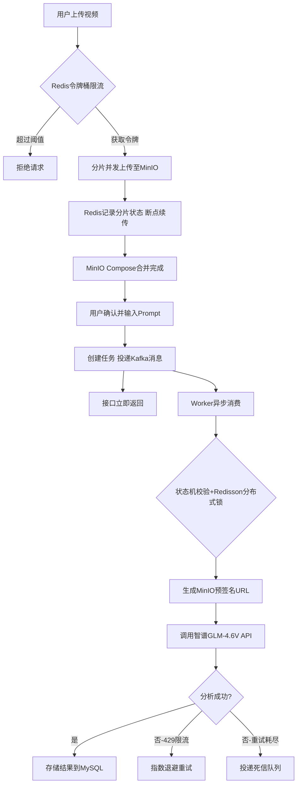

<div align="center">

# DoVideoAI - 智能视频内容理解平台

<p>
  <strong>分片断点续传 / Kafka异步解耦 / AI视频分析 / 状态机驱动</strong>
</p>

<p>
  
  
  
  
  
  
</p>

</div>

<br>

**DoVideoAI** 是一个面向视频内容理解的 AI 分析平台。用户上传视频后，系统自动调用大模型进行内容分析，返回结构化的场景描述、关键帧、标签等结果。

针对视频处理场景中常见的 **"大文件上传不稳定"**、**"长耗时任务阻塞"**、**"高并发资源冲突"** 等痛点，本项目采用 **Kafka + Redisson + 分片续传** 的异步架构，实现上传与分析的完全解耦。

初心是用来解决个人需求：本人和朋友喜欢玩 APEX (一款三人小队 fps 大逃杀游戏)，为了高效复盘（抓战犯），才萌生了做这个项目的想法。后续会开放给社区使用，也算是一位爱玩派派玩家的社区回馈把！

Todo：

1. 目前只能上传单人视角，后期想把三人视角对齐一块传给大模型，让他同时接收三个人的视角信息。模型要部署在个人服务器上，基于 GLM-4.6V-Flash 9 B 模型，要做微调。

<br>

## 核心功能

**1. 稳定上传体验**

分片断点续传：支持 GB 级大文件上传，采用 Redis 维护分片状态 + MinIO Compose API 服务端合并。弱网断连后可从断点续传，无需重新上传。

秒传去重：基于文件 MD5 指纹识别，已上传过的文件直接跳过，节省带宽和存储。

**2. 异步任务处理**

Kafka 解耦：上传完成后，Controller 仅投递一条 Kafka 消息即刻返回（<50ms），后续 AI 分析由 Worker 异步完成，彻底告别页面转圈。

状态机驱动：TaskStatus 状态机严格控制任务流转（PENDING → QUEUED → PROCESSING → COMPLETED/FAILED/DEAD），天然幂等，避免重复处理。

**3. 高并发防护**

三级限流：Guava 令牌桶（全局）→ Redis 原子计数器（用户级）→ 端点级精细控制。

分布式锁：Redisson + WatchDog 机制，防止同一分片被并发上传、同一任务被并发处理。

**4. AI 视频分析**

集成智谱 GLM-4.6V 多模态模型，原生支持 `video_url` 视频理解。用户可自定义 Prompt，例如**游戏复盘分析、课程内容总结等**。内置 429 限流自动重试（指数退避：10s/30s/60s）。

**5. 双认证体系**

JWT Bearer Token + API Key 双模式认证，灵活适配 Web 端和 API 调用场景。

<br>

## 技术架构



<br>

## 技术栈

| 类别 | 技术选型 | 说明 |
| :--- | :--- | :--- |
| 核心框架 | Spring Boot 3.2.4 | Java 17 |
| 数据库 | MySQL 8.0 + MyBatis-Plus | Druid 连接池 |
| 缓存 | Redis 7.0 + Redisson | 分布式锁 + 限流计数 |
| 消息队列 | Kafka 3.6.x | 手动 ack + 死信队列 |
| 对象存储 | MinIO 8.5.9 | 分片上传 + 预签名 URL |
| AI 服务 | 智谱 GLM-4.6V | video_url 原生视频理解 |
| 接口文档 | SpringDoc OpenAPI | Swagger UI |
| 前端 | 纯 HTML/CSS/JS SPA | 无框架依赖 |
| 部署 | Docker Compose | 一键启动所有中间件 |

<br>

## 项目结构

```
DoVideoAI/
├── video-api/              # API 服务（REST 入口，port 8080）
├── video-worker/           # Worker 服务（异步任务处理，port 8081）
├── video-common/           # 公共模块（领域模型、DTO、枚举、消息类型）
├── video-infrastructure/   # 基础设施（MySQL、Redis、Kafka、MinIO）
├── frontend/               # 前端 SPA（HTML/CSS/JS）
├── docs/                   # 架构设计文档 + 面试考点
├── sql/                    # 数据库建表脚本
└── docker/                 # Docker Compose 配置
```

<br>

## 快速开始

### 1. 启动中间件

```bash
cd docker && docker-compose up -d
```

一键启动 MySQL(13306)、Redis(16379)、Kafka(19092)、MinIO(9000/9001)。

### 2. 配置文件

两个服务各有 `application-dev.yml.example` 模板，复制后填入实际配置即可：

```bash
# API 服务配置
cp video-api/src/main/resources/application-dev.yml.example \
   video-api/src/main/resources/application-dev.yml

# Worker 服务配置
cp video-worker/src/main/resources/application-dev.yml.example \
   video-worker/src/main/resources/application-dev.yml
```

需要配置的内容：

| 配置项 | 说明 |
| :--- | :--- |
| `spring.datasource.*` | MySQL 连接信息（地址、用户名、密码） |
| `spring.data.redis.*` | Redis 连接信息 |
| `spring.kafka.bootstrap-servers` | Kafka 地址 |
| `minio.*` | MinIO 地址和 Access Key / Secret Key |
| `ai.glm.api-key` | 智谱 AI API Key，[点这里申请](https://open.bigmodel.cn/)（GLM-4V-Flash 免费） |

### 3. 编译项目

```bash
mvn clean install -DskipTests
```

### 4. 启动服务

```bash
# API 服务（port 8080）
cd video-api && mvn spring-boot:run -Dspring-boot.run.profiles=dev

# Worker 服务（port 8081）
cd video-worker && mvn spring-boot:run -Dspring-boot.run.profiles=dev
```

### 5. 访问

| 服务 | 地址 |
| :--- | :--- |
| 前端页面 | 打开 `frontend/index.html` |
| Swagger UI | http://localhost:8080/swagger-ui.html |
| MinIO 控制台 | http://localhost:9001 |

<br>

## 架构亮点

| 亮点 | 说明 | 状态 |
| :--- | :--- | :--- |
| 分片上传 + 断点续传 + 秒传 | Redisson 分布式锁双重检查，20MB 分片 3 并发 | ✅ |
| 两阶段任务创建 | 上传与任务解耦，用户确认 + 自定义 Prompt 后才创建任务 | ✅ |
| Kafka 异步解耦 | 削峰填谷，手动 ack，死信队列兜底 | ✅ |
| 状态机驱动 | TaskStatus 控制任务流转，天然幂等 | ✅ |
| 双认证体系 | JWT Bearer + API Key | ✅ |
| 三级限流 | Guava 全局 → Redis 用户级 → 端点级 | ✅ |
| 统一响应 | ApiResponse + ErrorCode 结构化错误码 | ✅ |
| AI 429 自动重试 | 指数退避，最多 3 次重试 | ✅ |

<br>

## 贡献与支持

如果这个项目对你有帮助，请给个 Star ⭐️⭐️⭐️⭐️⭐️！

(⊙o⊙)

[ 小史山，高耦合低内聚，真诚不建议作为各位简历学习项目，请让我独享史山QAQ。 ]

[ 这个项目最初是为了把视频分析这个场景完整做一遍——从上传、存储、消息队列到 AI 调用，把每个环节的坑都踩一遍。过程中确实踩了不少：Kafka ack 丢消息、智谱 SDK 吞异常、MinIO 预签名签名不匹配……这些问题光看文档是遇不到的。 ]

[ 此项目是 MVP 版本，总的来看也只是调用第三方API的毫无亮点的项目。亮点都是要挖掘需求点一点点去增加的，而非看到优点去倒推需求。所以真诚的认为，与其在乎项目是否烂大街，不如提升自己对项目需求的思考 ]

<font color="red">**[ 这远比项目本身是什么本身重要的多。]**</font>

<br>

## License

MIT
