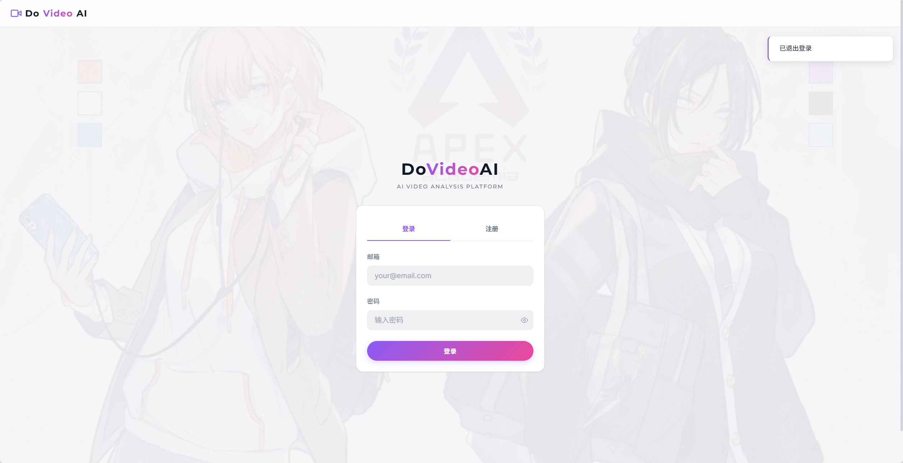
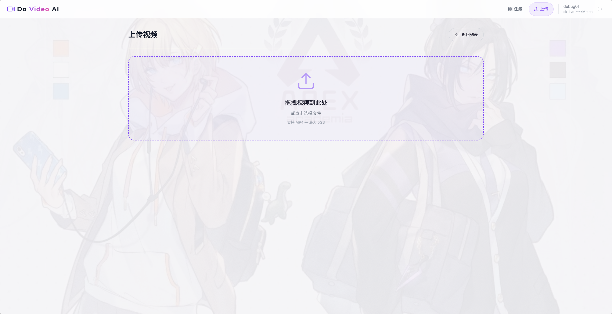
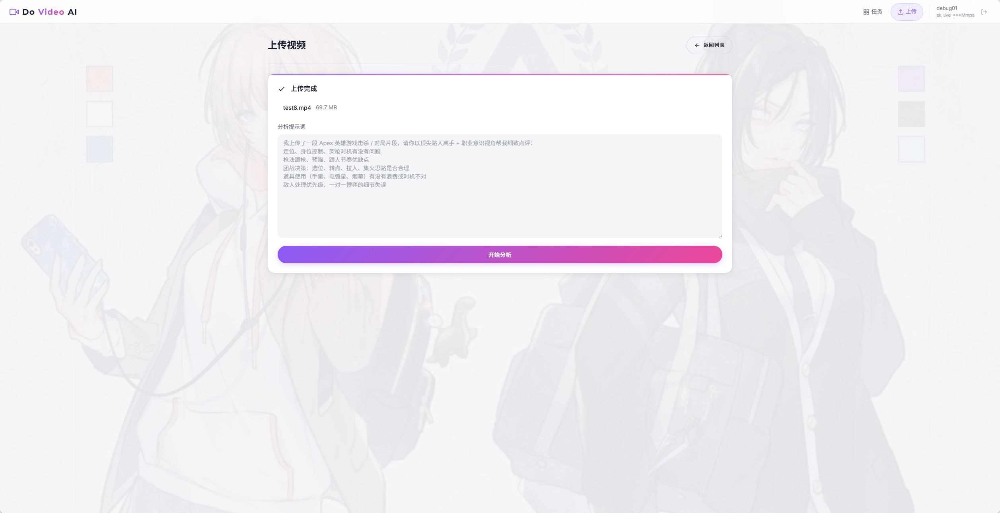
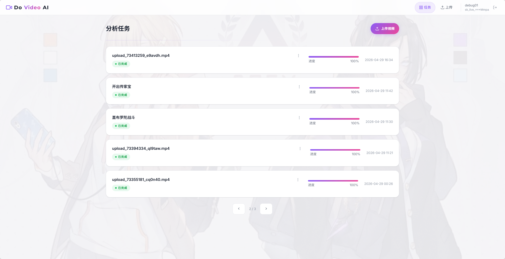
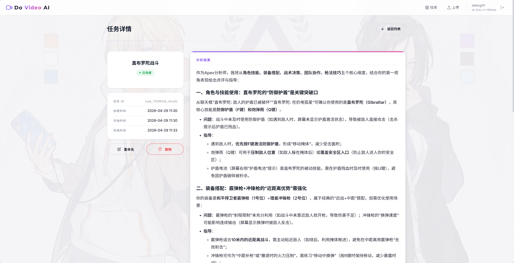
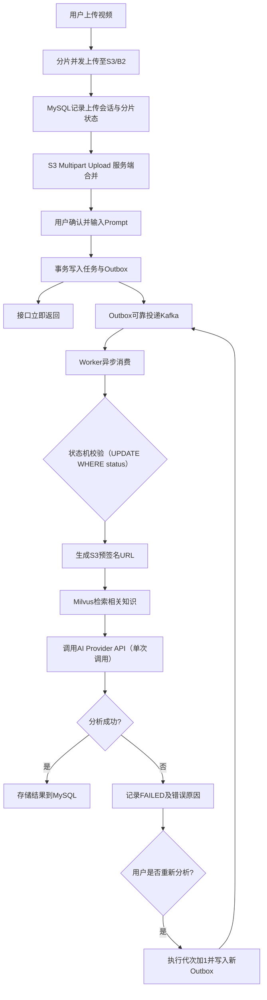

<div align="center">

# VideoAIPlatform - 智能视频内容理解平台

<p>
  <strong>分片断点续传 / Kafka异步解耦 / RAG知识增强 / AI视频分析</strong>
</p>

<p>
  
  
  
  
  
  
</p>

</div>

<br>

**VideoAIPlatform** 是一个面向视频内容理解的 AI 分析平台。用户上传视频后，系统自动调用大模型进行内容分析，返回结构化的场景描述、关键帧、标签等结果。

针对视频处理场景中常见的 **"大文件上传不稳定"**、**"长耗时任务阻塞"**、**"重复消息导致重复执行"** 等痛点，本项目采用 **分片续传 + Outbox + Kafka + 状态机幂等** 的异步架构，实现上传与分析解耦。

## 界面预览

<p align="center">
  
  <br>
  <sub>登录 / 注册页面</sub>
</p>

<p align="center">
  
  <br>
  <sub>视频上传 — 分片断点续传 + 秒传</sub>
</p>

<p align="center">
  
  <br>
  <sub>确认分析 — 自定义 Prompt 提交任务</sub>
</p>

<p align="center">
  
  <br>
  <sub>任务列表 — 进度追踪 + 状态管理</sub>
</p>

<p align="center">
  
  <br>
  <sub>AI 分析结果 — Markdown 渲染</sub>
</p>

<br>

初心是用来解决个人需求：本人和朋友喜欢玩 APEX (一款三人小队 fps 大逃杀游戏)，为了高效复盘（抓战犯），才萌生了做这个项目的想法。后续会开放给社区使用，也算是一位爱玩派派玩家的社区回馈把！

Todo：

1. 目前只能上传单人视角，后期想把三人视角对齐一块传给大模型，让他同时接收三个人的视角信息。模型要部署在个人服务器上，基于 GLM-4.6V-Flash 9 B 模型，要做微调。

<br>

## 核心功能

**1. 稳定上传体验**

分片断点续传：前端默认按 5MB 分片、3 路并发上传，后端通过 MySQL `upload_session` 保存上传会话和已完成分片，并使用 S3 Multipart Upload API 服务端合并。支持 MinIO / Backblaze B2，弱网断连后可从断点继续上传。

秒传去重：基于文件 MD5 指纹识别，已上传过的文件直接跳过，节省带宽和存储。

**2. 异步任务处理**

Kafka 解耦：用户确认后，API 将任务与 Outbox 事件原子落库并立即返回 taskId，后续 AI 分析由 Worker 异步完成。

状态机驱动：TaskStatus 状态机严格控制任务流转（PENDING → QUEUED → PROCESSING → COMPLETED/FAILED），结合执行代次实现幂等，避免重复消息触发重复处理。

**3. 并发一致性**

分布式锁：Redisson + WatchDog 机制，防止同一分片被并发上传、同一上传被重复提交。

**4. AI 视频分析**

集成多模态视频理解模型，通过 Provider 接口解耦底层大模型厂商，支持 **阿里云 DashScope（Qwen-VL）**、**智谱 GLM** 和 **OpenAI-compatible** 服务按配置切换。用户可自定义 Prompt，例如**游戏复盘分析、课程内容总结等**。每个执行代次只调用一次 AI，失败后记录原因并由用户决定是否重新分析。

**5. RAG 知识增强**

将 Markdown 知识按标题层级和段落切分，通过 DashScope Embedding 向量化并写入 Milvus，使用 HNSW + COSINE 检索相关知识片段注入视频分析 Prompt；检索异常时 fail-open，不阻断主分析链路。

**6. 双认证体系**

JWT Bearer Token + API Key 双模式认证，灵活适配 Web 端和 API 调用场景。

<br>

## 技术架构


```mermaid
graph TD
    A[用户上传视频] --> D[分片并发上传至S3/B2]
    D --> E[MySQL记录上传会话与分片状态]
    E --> F[S3 Multipart Upload 服务端合并]

    F --> G[用户确认并输入Prompt]
    G --> H[事务写入任务与Outbox]
    H --> I[接口立即返回]

    H --> R[Outbox可靠投递Kafka]
    R --> J[Worker异步消费]
    J --> K{状态机校验（UPDATE WHERE status）}
    K --> L[生成S3预签名URL]
    L --> T[Milvus检索相关知识]
    T --> M[调用AI Provider API（单次调用）]
    M --> N{分析成功?}
    N -- 是 --> O[存储结果到MySQL]
    N -- 否 --> P[记录FAILED及错误原因]
    P --> Q{用户是否重新分析?}
    Q -- 是 --> S[执行代次加1并写入新Outbox]
    S --> R
```

<br>

## 技术栈

| 类别 | 技术选型 | 说明 |
| :--- | :--- | :--- |
| 核心框架 | Spring Boot 3.2.4 | Java 17 |
| 数据库 | MySQL 8.0 + MyBatis-Plus | Druid 连接池 |
| 缓存与锁 | Redis 7.0 + Redisson | 分布式锁、上传并发互斥 |
| 消息队列 | Kafka 3.6.x | 手动 ack + Outbox 可靠投递 |
| 对象存储 | AWS S3 SDK / Backblaze B2 | S3 Multipart Upload + 预签名 URL，兼容 MinIO |
| 向量数据库 | Milvus 2.4.x | HNSW + COSINE 向量检索 |
| AI 服务 | 阿里 Qwen-VL / 智谱 GLM / OpenAI-compatible | Provider 接口解耦，配置化切换 |
| RAG | DashScope text-embedding-v3 | Markdown 分块、跨语言检索、fail-open 降级 |
| 接口文档 | SpringDoc OpenAPI | Swagger UI |
| 前端 | 纯 HTML/CSS/JS SPA | 无框架依赖 |
| 部署 | Docker Compose | 一键启动所有中间件 |

<br>

## 项目结构

```
VideoAIPlatform/
├── video-api/              # API 服务（REST 入口，port 8080）
├── video-worker/           # Worker 服务（异步任务处理，port 8081）
├── video-rag/              # RAG 领域服务（分块、索引、检索与编排）
├── video-common/           # 公共模块（领域模型、DTO、枚举、消息类型）
├── video-infrastructure/   # 基础设施（MySQL、Redis、Kafka、S3、Milvus）
├── frontend/               # 前端 SPA（HTML/CSS/JS）
├── architecture/           # 架构决策与参数设计文档
├── rag-data/               # 结构化领域知识与检索评估数据
├── scripts/                # RAG 评估与知识审计脚本
├── sql/                    # 数据库建表脚本
└── docker/                 # Docker Compose 配置
```

<br>

## 快速开始

### 1. 启动中间件

```bash
cd docker && docker-compose up -d
```

默认启动 MySQL(13306)、Redis(16379)、Kafka(19092) 和 Kafka UI(8090)。如需本地 MinIO(9000/9001)：`docker compose --profile minio up -d`；如需本地 Milvus(19530)：`docker compose --profile milvus up -d`。

### 2. 配置文件

两个服务各有 `application-dev.yml.example` 模板，复制后填入实际配置即可：

```bash
# API 服务配置
cp video-api/src/main/resources/application-dev.yml.example \
   video-api/src/main/resources/application-dev.yml

# Worker 服务配置
cp video-worker/src/main/resources/application-dev.yml.example \
   video-worker/src/main/resources/application-dev.yml
```

需要配置的内容：

| 配置项 | 说明 |
| :--- | :--- |
| `spring.datasource.*` | MySQL 连接信息（地址、用户名、密码） |
| `spring.data.redis.*` | Redis 连接信息 |
| `spring.kafka.bootstrap-servers` | Kafka 地址 |
| `VIDEOAI_KAFKA_TASK_PARTITIONS` | 视频分析 Topic 分区数，默认 `6` |
| `VIDEOAI_KAFKA_TASK_REPLICAS` | Topic 副本数，本地默认 `1`，多 Broker 生产集群按规划调整 |
| `VIDEOAI_WORKER_CONCURRENCY` | 单个 Worker 内 Consumer 数，默认 `3` |
| `VIDEOAI_OUTBOX_BATCH_SIZE` | Outbox 每轮候选批次，实测默认 `50` |
| `VIDEOAI_OUTBOX_FIXED_DELAY_MS` | Outbox 扫描间隔，实测默认 `1000ms` |
| `VIDEOAI_OUTBOX_MAX_IN_FLIGHT` | Kafka 在途发送上限，实测默认 `10` |
| `minio.*` | 对象存储配置（MinIO / Backblaze B2 地址和凭证）|
| `ai.dashscope.api-key` | 阿里云 DashScope API Key，[点这里申请](https://dashscope.console.aliyun.com/) |
| `ai.zhipu.api-key` | 智谱 AI API Key，[点这里申请](https://open.bigmodel.cn/) |
| `ai.provider` | 底层大模型选择：`dashscope`（默认）/ `zhipu` / `openai-compatible` |
| `videoai.rag.*` | RAG 开关、Embedding、Milvus 和检索参数 |

> **Kafka 长任务配置：** Worker 的 AI 任务最长可能运行 30 分钟。Consumer 默认一次只拉取 1 条任务，并将 `max.poll.interval.ms` 设置为 40 分钟，避免同步处理期间因长时间不 poll 被移出消费组。两个参数分别支持通过 `KAFKA_CONSUMER_MAX_POLL_RECORDS` 和 `KAFKA_CONSUMER_MAX_POLL_INTERVAL_MS` 覆盖；嵌入式 Kafka 集成测试和配置绑定测试共同覆盖该边界。

```yaml
spring:
  kafka:
    consumer:
      max-poll-records: ${KAFKA_CONSUMER_MAX_POLL_RECORDS:1}
      properties:
        "[max.poll.interval.ms]": ${KAFKA_CONSUMER_MAX_POLL_INTERVAL_MS:2400000}
```

`max-poll-records=1` 只限制单个 Consumer 每次领取的任务数量，不会把整个 Worker 变成单线程。监听器默认通过 `videoai.worker.concurrency=3` 启动 3 个 Consumer；初期生产建议部署 2 个 Worker 副本，与默认 6 个 Partition 组成最多 6 路并行消费。Worker 副本数属于部署平台配置，不写死在应用代码中。

项目通过 Spring Kafka `NewTopic` 显式声明 `videoai.task.analyze`，Topic 不存在时按配置创建；已有 Topic 分区不足时会增加到配置值，不再依赖 Broker 自动建 Topic 的默认分区数。完整的参数计算、扩缩容和幂等边界见 [Kafka 分区、Consumer Group 与 Worker 部署参数设计](architecture/kafka-partition-consumer-sizing.md)。

Outbox 调度器采用“数据库抢占 + 有界异步发送”：先通过条件更新把消息从 `NEW` 抢占为 `SENDING`，再异步发送 Kafka；回调线程把成功消息更新为 `SENT`，失败消息退回可重试状态，超时停留在 `SENDING` 的消息由恢复扫描重新接管。这样既避免同步逐条等待 Kafka 回执造成的队头阻塞，也用 `max-in-flight=10` 限制并发，防止无界堆积。100 条任务的同条件对照中，Outbox p95 从 `24.51s` 降到 `11.80s`（约下降 52%）。完整压测方法、原始参数矩阵和结论见 [全链路压测指南](architecture/load-test/README.md) 与 [压测实测报告](architecture/load-test/RESULTS.md)。

### 3. 编译项目

```bash
mvn clean install -DskipTests
```

运行全部测试：

```bash
mvn test
```

当前长任务相关测试包括配置绑定测试、Outbox 异步发送状态测试和嵌入式 KRaft Kafka 对照测试，覆盖“超过最大 poll 间隔时提交失败”“处理时间在安全范围内时提交成功”以及发送成功、失败和抢占冲突等边界。

### 4. 启动服务

```bash
# API 服务（port 8080）
cd video-api && mvn spring-boot:run -Dspring-boot.run.profiles=dev

# Worker 服务（port 8081）
cd video-worker && mvn spring-boot:run -Dspring-boot.run.profiles=dev
```

### 5. 启动前端（可选，但推荐）

前端是纯静态 SPA，建议在 `frontend/` 目录启动本地静态服务：

```bash
# 方式一（推荐，Node 环境）
npx --yes serve frontend -l 5173

# 方式二（Python 环境）
python -m http.server 5173 --directory frontend
```

启动后访问：`http://localhost:5173`

### 6. 访问

| 服务 | 地址 |
| :--- | :--- |
| 前端页面 | http://localhost:5173（或直接打开 `frontend/index.html`） |
| Swagger UI | http://localhost:8080/swagger-ui.html |
| MinIO 控制台 | http://localhost:9001（仅本地 MinIO 时可用）|

<br>

## 架构亮点

| 亮点 | 说明 | 状态 |
| :--- | :--- | :--- |
| 分片上传 + 断点续传 + 秒传 | S3 Multipart Upload，MySQL 记录分片状态，Redisson 分布式锁，默认 5MB 分片 3 并发 | ✅ |
| 两阶段任务创建 | 上传与任务解耦，用户确认 + 自定义 Prompt 后才创建任务 | ✅ |
| Kafka 异步解耦 | 削峰填谷，手动 ack，Outbox 保证最终投递 | ✅ |
| Kafka 消费拓扑 | 默认 6 分区；单 Worker 3 Consumer；同组多 Worker 可横向扩容 | ✅ |
| Kafka 长任务消费 | 单条拉取，最大 poll 间隔 40 分钟，集成测试验证超时与正常提交边界 | ✅ |
| 状态机与执行代次 | 条件更新控制状态流转，隔离重复消息和旧执行消息 | ✅ |
| 双认证体系 | JWT Bearer + API Key | ✅ |
| 统一响应 | ApiResponse + ErrorCode 结构化错误码 | ✅ |
| AI Provider 解耦 | 接口抽象，支持 DashScope、智谱和 OpenAI-compatible 服务 | ✅ |
| AI 失败手动重试 | 单次执行只调用一次 AI，失败落库后由用户重新提交，执行代次隔离迟到消息 | ✅ |
| RAG 知识增强 | Markdown 分块、Milvus 向量检索、上下文注入与 fail-open | ✅ |

<br>

## 贡献与支持

如果这个项目对你有帮助，请给个 Star ⭐️！

(⊙o⊙)

[ 这个项目最初是为了把视频分析这个场景完整做一遍——从上传、存储、消息队列到 AI 调用，把每个环节的坑都踩一遍。过程中确实踩了不少：Kafka 长任务触发 Rebalance 与 offset 提交失败、智谱 SDK 异常处理、S3 预签名签名不匹配……这些问题光看文档是遇不到的。 ]

[ 此项目是 MVP 版本，总的来看只是组合调用第三方大模型 API 的项目。亮点是要挖掘业务需求一点点去增加的，而非看到优点去倒推需求。所以，与其在乎项目是否烂大街，不如提升对项目需求的思考，技术的应用 ]

<font color="red">**[ 技术的掌握和运用，比项目本身是什么来的重要的多。]**</font>

<br>

## License

MIT
