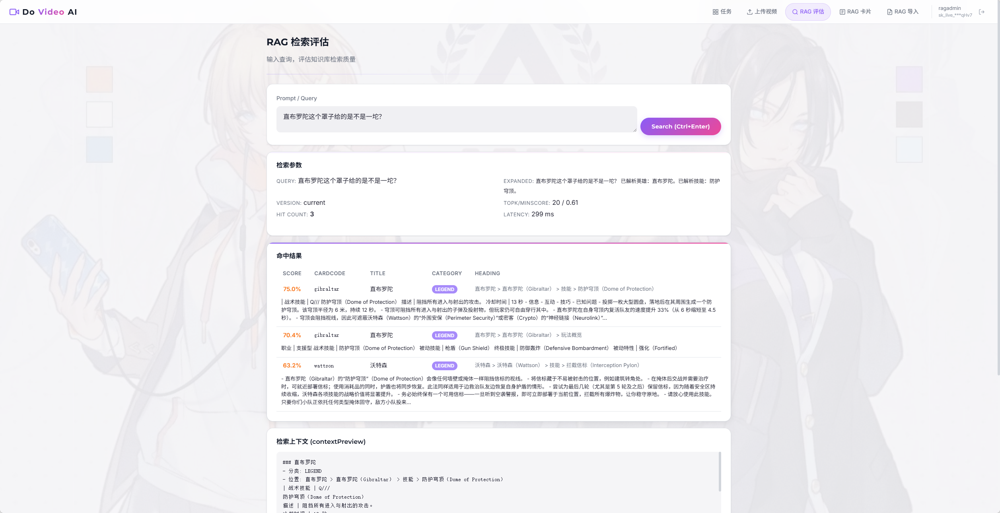
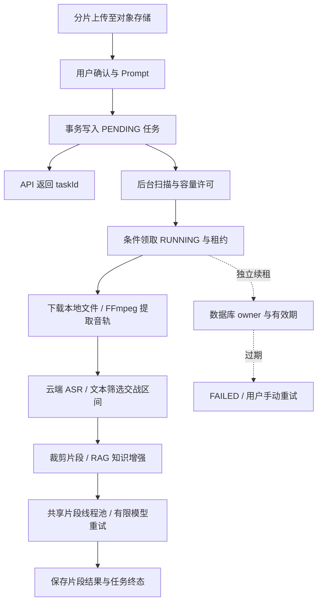

<div align="center">

# VideoAIPlatform - 智能视频内容理解平台

<p>
  <strong>分片断点续传 / 数据库异步调度 / RAG知识增强 / AI视频分析</strong>
</p>

<p>
  
  
  
  
  
  
</p>

</div>

<br>

**VideoAIPlatform** 是一个面向视频内容理解的 AI 分析平台。用户上传视频后，系统自动调用大模型进行内容分析，返回结构化的场景描述、关键帧、标签等结果。

针对视频处理场景中常见的 **"大文件上传不稳定"**、**"长耗时任务阻塞"**、**"执行中断与迟到结果"** 等痛点，本项目采用 **分片续传 + 数据库任务表 + 后台调度器 + 租约保护** 的异步架构，实现上传与分析解耦。

## 界面预览

<p align="center">
  
  <br>
  <sub>登录 / 注册页面</sub>
</p>

<p align="center">
  
  <br>
  <sub>视频上传 — 分片断点续传 + 秒传</sub>
</p>

<p align="center">
  
  <br>
  <sub>确认分析 — 自定义 Prompt 提交任务</sub>
</p>

<p align="center">
  
  <br>
  <sub>任务列表 — 进度追踪 + 状态管理</sub>
</p>

<p align="center">
  
  <br>
  <sub>AI 分析结果 — Markdown 渲染</sub>
</p>

<p align="center">
  
  <br>
  <sub>RAG 检索评估 — 查询增强、召回分数、标题路径与注入上下文可视化</sub>
</p>
<br>

初心是用来解决个人需求：本人和朋友喜欢玩 APEX (一款三人小队 fps 大逃杀游戏)，为了高效复盘（抓战犯），才萌生了做这个项目的想法。后续会开放给社区使用，也算是一位爱玩派派玩家的社区回馈把！

Todo：

1. 目前只能上传单人视角，后期想把三人视角对齐一块传给大模型，让他同时接收三个人的视角信息。模型要部署在个人服务器上，基于 GLM-4.6V-Flash 9 B 模型，要做微调。

<br>

## 核心功能

**1. 稳定上传体验**

分片断点续传：前端默认按 5MB 分片、3 路并发上传，后端通过 MySQL `upload_session` 保存上传会话和已完成分片，并使用 S3 Multipart Upload API 服务端合并。支持 MinIO / Backblaze B2，弱网断连后可从断点继续上传。

秒传去重：基于文件 MD5 指纹识别，已上传过的文件直接跳过，节省带宽和存储。

**2. 异步任务处理**

数据库调度：用户确认后，API 将 PENDING 任务落库并立即返回 taskId。Worker 有空闲视频容量时才条件领取，耗时分析在线程池中执行。

状态流转：PENDING → RUNNING → SUCCEEDED/PARTIAL/FAILED，可取消为 CANCELLED。独立定时续租，结果写入校验 owner、执行代次和租约；过期任务标记失败，由用户决定是否重试。

**3. 并发一致性**

分布式锁：Redisson + WatchDog 机制，防止同一分片被并发上传、同一上传被重复提交。

**4. AI 视频分析**

集成多模态视频理解模型，通过 Provider 接口解耦底层大模型厂商，支持 **阿里云 DashScope（Qwen-VL）**、**智谱 GLM** 和 **OpenAI-compatible** 服务按配置切换。用户可自定义 Prompt，例如**游戏复盘分析、课程内容总结等**。音频转写和文本粗筛确定候选区间，再裁剪视频、检索领域知识、并行分析片段。模型调用对明确可重试错误做有限重试，保留各片段结果，不额外调用模型汇总。

**5. RAG 知识增强**

围绕 PC 端 Apex 英雄知识构建独立的中文 RAG 链路，目前收录 28 个英雄。原始 Wiki 内容经过正文提取、噪声清理、中文化和 Markdown 结构化后，按照标题层级、段落、句子与列表边界进行语义切分；当前基线参数为目标 650 字符、最小 400、最大 800、重叠 100，共生成 223 个 chunk。

索引阶段使用 DashScope `text-embedding-v3` 生成向量，同时将原文、英雄、标题路径、分类等元数据写入 Milvus，MySQL 保存卡片、chunk 和索引任务状态。检索阶段先识别中文英雄名和玩家俗称，再通过 HNSW + COSINE 召回候选片段，经过分数阈值、单卡片数量和上下文长度控制后注入视频分析 Prompt。检索异常采用 fail-open，不阻断主分析链路。

项目提供独立的 **RAG 检索评估页面**，可以直接观察原始 Query、别名增强后的 Query、召回分数、命中标题路径以及最终注入模型的上下文，便于定位“英雄找错”“章节找错”和“范围外问题误召回”等问题。

当前 `bench` 基线使用 36 条中文问题连续运行 3 轮，结果保持一致：

| 指标 | 结果 |
| :--- | ---: |
| 英雄 Entity Hit@1 | 100% |
| 章节 Section Hit@K | 96.43% |
| 范围外问题拒答率 | 75% |
| 服务端检索延迟 P50 / P95 | 约 262ms / 352ms |
| MySQL chunk / Milvus vector 一致性 | 223 / 223 |

> 该结果是当前 28 个英雄、36 条人工标注问题上的工程基线，用于后续切片、阈值和检索策略的对照实验，不代表线上生产准确率。

**6. 双认证体系**

JWT Bearer Token + API Key 双模式认证，灵活适配 Web 端和 API 调用场景。

<br>

## 技术架构


```mermaid
graph TD
    A[分片上传至对象存储] --> B[用户确认与 Prompt]
    B --> C[事务写入 PENDING 任务]
    C --> D[API 返回 taskId]
    C --> E[后台扫描与容量许可]
    E --> F[条件领取 RUNNING 与租约]
    F --> G[下载本地文件 / FFmpeg 提取音轨]
    G --> H[云端 ASR / 文本筛选交战区间]
    H --> I[裁剪片段 / RAG 知识增强]
    I --> J[共享片段线程池 / 有限模型重试]
    J --> K[保存片段结果与任务终态]
    F -. 独立续租 .-> L[数据库 owner 与有效期]
    L -. 过期 .-> M[FAILED / 用户手动重试]
```

<br>

## 技术栈

| 类别 | 技术选型 | 说明 |
| :--- | :--- | :--- |
| 核心框架 | Spring Boot 3.2.4 | Java 17 |
| 数据库 | MySQL 8.0 + MyBatis-Plus | Druid 连接池 |
| 缓存与锁 | Redis 7.0 + Redisson | 分布式锁、上传并发互斥 |
| 后台调度 | MySQL 任务表 + Java 线程池 | 条件领取、独立续租、条件写入 |
| 对象存储 | AWS S3 SDK / Backblaze B2 | S3 Multipart Upload + 预签名 URL，兼容 MinIO |
| 向量数据库 | Milvus 2.4.x | HNSW + COSINE 向量检索 |
| AI 服务 | 阿里 Qwen-VL / 智谱 GLM / OpenAI-compatible | Provider 接口解耦，配置化切换 |
| RAG | DashScope text-embedding-v3 | 层级感知分块、中文英雄别名增强、可视化评估、fail-open 降级 |
| 接口文档 | SpringDoc OpenAPI | Swagger UI |
| 前端 | 纯 HTML/CSS/JS SPA | 无框架依赖 |
| 部署 | Docker Compose | 一键启动所有中间件 |

<br>

## 项目结构

```
VideoAIPlatform/
├── video-api/              # API 服务（REST 入口，port 8080）
├── video-worker/           # Worker 服务（异步任务处理，port 8081）
├── video-rag/              # RAG 领域服务（分块、索引、检索与编排）
├── video-common/           # 公共模块（领域模型、DTO、枚举、执行上下文）
├── video-infrastructure/   # 基础设施（MySQL、Redis、S3、Milvus）
├── frontend/               # 前端 SPA（HTML/CSS/JS）
├── architecture/           # 架构决策与参数设计文档
├── rag-data/               # 结构化领域知识与检索评估数据
├── scripts/                # RAG 评估与知识审计脚本
├── sql/                    # 数据库建表脚本
└── docker/                 # Docker Compose 配置
```

<br>

## 快速开始

### 1. 启动中间件

```bash
cd docker && docker-compose up -d
```

默认启动 MySQL(13306)、Redis(16379)。如需本地 MinIO(9000/9001)：`docker compose --profile minio up -d`；如需本地 Milvus(19530)：`docker compose --profile milvus up -d`。

### 2. 配置文件

两个服务各有 `application-dev.yml.example` 模板，复制后填入实际配置即可：

```bash
# API 服务配置
cp video-api/src/main/resources/application-dev.yml.example \
   video-api/src/main/resources/application-dev.yml

# Worker 服务配置
cp video-worker/src/main/resources/application-dev.yml.example \
   video-worker/src/main/resources/application-dev.yml
```

需要配置的内容：

| 配置项 | 说明 |
| :--- | :--- |
| `spring.datasource.*` | MySQL 连接信息（地址、用户名、密码） |
| `spring.data.redis.*` | Redis 连接信息 |
| `videoai.dispatch.video-concurrency` | 单 Worker 同时在途视频数，默认 `3` |
| `minio.*` | 对象存储配置（MinIO / Backblaze B2 地址和凭证）|
| `ai.dashscope.api-key` | 阿里云 DashScope API Key，[点这里申请](https://dashscope.console.aliyun.com/) |
| `ai.zhipu.api-key` | 智谱 AI API Key，[点这里申请](https://open.bigmodel.cn/) |
| `ai.provider` | 底层大模型选择：`dashscope`（默认）/ `zhipu` / `openai-compatible` |
| `videoai.rag.*` | RAG 开关、Embedding、Milvus 和检索参数 |

后台调度默认每秒扫描，先取得视频容量再领取任务；独立线程每 20 秒续租，租约为 90 秒。任务耗时不受消息消费间隔限制，但各外部请求仍有超时。失效执行者不能覆盖当前结果，过期任务不会自动重放付费调用。

新版本使用 `sql/schema.sql` 的新表结构，不兼容旧任务状态。已有开发数据库应保留，另建隔离库验证，不能直接用旧表启动新版本。设计与阶段验收见 [数据库调度实施方案](architecture/database-task-scheduler-implementation.md)。

### 3. 编译项目

```bash
mvn clean install -DskipTests
```

运行全部测试：

```bash
mvn test
```

调度测试覆盖并发领取、容量控制、独立续租、过期失败、迟到写入拦截和片段实际退出。真实 MySQL 验收默认跳过，显式启用后创建并清理专用测试库，要求建库权限。历史 Kafka 实验仅用于记录架构演进，不代表当前运行方式。

### 4. 启动服务

```bash
# API 服务（port 8080）
cd video-api && mvn spring-boot:run -Dspring-boot.run.profiles=dev

# Worker 服务（port 8081）
cd video-worker && mvn spring-boot:run -Dspring-boot.run.profiles=dev
```

### 5. 启动前端（可选，但推荐）

前端是纯静态 SPA，建议在 `frontend/` 目录启动本地静态服务：

```bash
# 方式一（推荐，Node 环境）
npx --yes serve frontend -l 5173

# 方式二（Python 环境）
python -m http.server 5173 --directory frontend
```

启动后访问：`http://localhost:5173`。管理员登录后可直接进入 `http://localhost:5173/#/rag-eval` 测试 RAG 召回效果。

### 6. 访问

| 服务 | 地址 |
| :--- | :--- |
| 前端页面 | http://localhost:5173（或直接打开 `frontend/index.html`） |
| RAG 检索评估 | http://localhost:5173/#/rag-eval |
| Swagger UI | http://localhost:8080/api/swagger-ui.html |
| MinIO 控制台 | http://localhost:9001（仅本地 MinIO 时可用）|

<br>

## 架构亮点

| 亮点 | 说明 | 状态 |
| :--- | :--- | :--- |
| 分片上传 + 断点续传 + 秒传 | S3 Multipart Upload，MySQL 记录分片状态，Redisson 分布式锁，默认 5MB 分片 3 并发 | ✅ |
| 两阶段任务创建 | 上传与任务解耦，用户确认 + 自定义 Prompt 后才创建任务 | ✅ |
| 数据库任务调度 | 容量控制、原子领取、独立续租与过期失败 | ✅ |
| 状态机与执行代次 | owner + attempt + 有效租约保护结果写入 | ✅ |
| 双认证体系 | JWT Bearer + API Key | ✅ |
| 统一响应 | ApiResponse + ErrorCode 结构化错误码 | ✅ |
| AI Provider 解耦 | 接口抽象，支持 DashScope、智谱和 OpenAI-compatible 服务 | ✅ |
| AI 失败处理 | 片段内部有限重试；整局失败由用户决定重试，隔离旧执行结果 | ✅ |
| RAG 知识增强 | 28 个 PC 英雄中文知识、层级感知分块、Milvus 检索、别名增强、评估页面与 fail-open | ✅ |

<br>

## 贡献与支持

如果这个项目对你有帮助，请给个 Star ⭐️！

(⊙o⊙)

[ 这个项目最初是为了把视频分析这个场景完整做一遍——从上传、存储、消息队列到 AI 调用，把每个环节的坑都踩一遍。过程中确实踩了不少：Kafka 长任务触发 Rebalance 与 offset 提交失败、智谱 SDK 异常处理、S3 预签名签名不匹配……这些问题光看文档是遇不到的。 ]

[ 此项目是 MVP 版本，总的来看只是组合调用第三方大模型 API 的项目。亮点是要挖掘业务需求一点点去增加的，而非看到优点去倒推需求。所以，与其在乎项目是否烂大街，不如提升对项目需求的思考，技术的应用 ]

<font color="red">**[ 技术的掌握和运用，比项目本身是什么来的重要的多。]**</font>

<br>

## License

MIT
