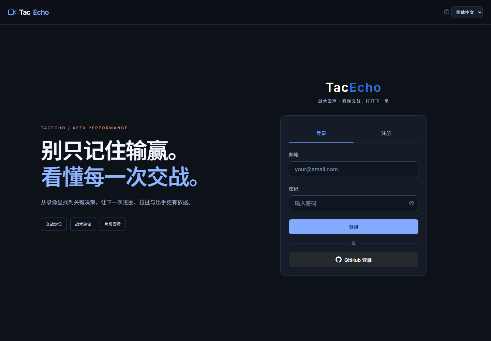
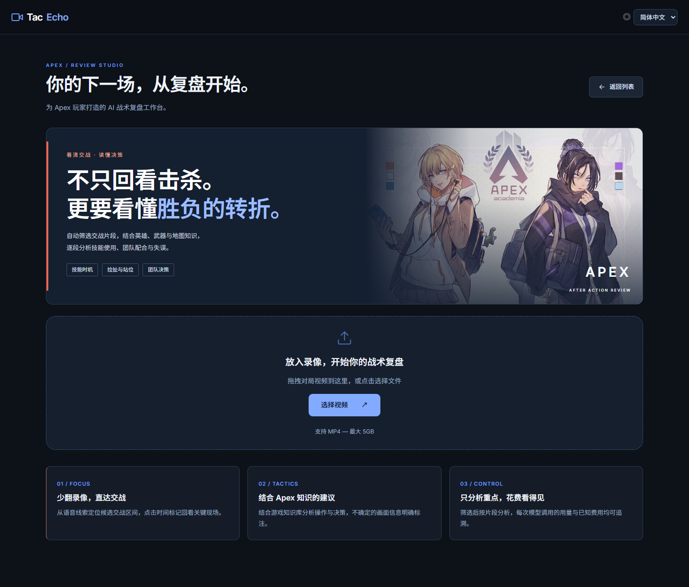
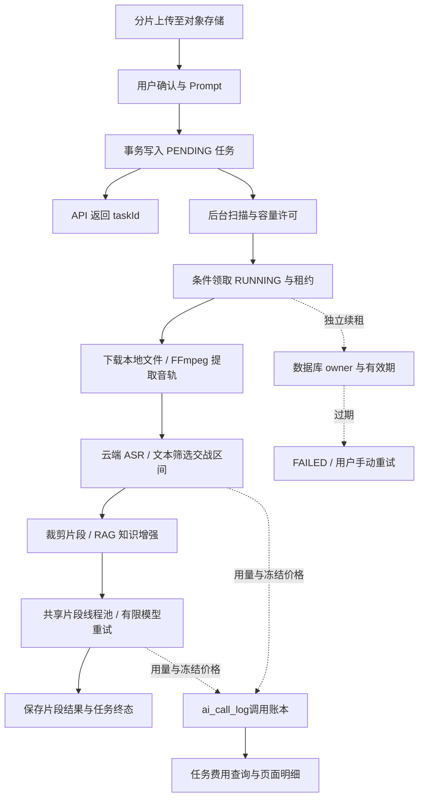

<div align="center">

# TacEcho · 战术回声

看懂每一次交战，让下一局更有依据。

<p>
  <strong>Apex AI 战术复盘 / 交战片段定位 / 领域知识增强 / 调用成本可追溯</strong>
</p>

<p>
  
  
  
  
  
  
</p>

</div>

<br>

**TacEcho（战术回声）** 是面向 Apex 玩家的 AI 视频复盘平台。用户上传录像后，系统通过语音转写和文本筛选定位交战候选，裁剪后并行分析，返回带原视频时间定位的片段观察、建议和不确定项。任务详情同时展示各阶段、片段的 Token 用量与估算费用。

针对视频处理场景中常见的 **"大文件上传不稳定"**、**"长耗时任务阻塞"**、**"执行中断与迟到结果"** 等痛点，本项目采用 **分片续传 + 数据库任务表 + 后台调度器 + 租约保护** 的异步架构，实现上传与分析解耦。

## 界面预览

新版采用深色工作台、蓝色操作按钮与 Apex 视觉元素，支持简体中文 / English 切换并保存语言偏好。界面切换不翻译用户输入和模型报告原文。

### 登录与注册



### 视频上传与复盘入口



> 图片截取自本地运行的当前前端，展示登录页与上传页的静态界面，不包含虚构任务结果或模型指标。

## 你可以用它做什么

- **少翻录像，定位交战**：语音转写与文本筛选生成候选区间，再裁剪送入视频模型；语音线索可能遗漏无交流交战，并不保证覆盖所有战斗。
- **带着上下文看决策**：结合 Apex 知识库，按片段展示画面观察、技能与团队决策建议，并标注不确定信息。
- **从建议回到现场**：切换片段查看结果，点击时间标记打开独立视频弹窗，不挤压复盘正文。
- **知道分析花在哪**：查看每阶段、每片段的调用用量与已知费用；未知费用明确标记，复用结果不伪装成新的调用。

项目起于与朋友复盘 Apex 对局的需求，重点在于把大文件上传、长耗时执行、领域知识和成本记录串成可使用的工程链路。

### 当前边界与后续计划

- 视频分析主链路由 MySQL 调度，不依赖 Kafka。可选的 [Kafka → Mock 邮件通知](architecture/email-notification-mock-validation.md) 默认关闭，仅模拟结束提醒，不发送真实邮件。
- [每日两次免费与付费积分](architecture/daily-quota-credit-plan.md) 目前仅为执行方案，尚未实现扣款与真实充值。
- 后续继续评估交战召回与复盘质量，再探索多视角时间对齐。

## 核心功能

**1. 稳定上传体验**

分片断点续传：前端默认按 5MB 分片、3 路并发上传，后端通过 MySQL `upload_session` 保存上传会话和已完成分片，并使用 S3 Multipart Upload API 服务端合并。支持 MinIO / Backblaze B2，弱网断连后可从断点继续上传。

秒传去重：基于文件 MD5 指纹识别，已上传过的文件直接跳过，节省带宽和存储。

**2. 异步任务处理**

数据库调度：用户确认后，API 将 PENDING 任务落库并立即返回 taskId。Worker 有空闲视频容量时才条件领取，耗时分析在线程池中执行。

状态流转：PENDING → RUNNING → SUCCEEDED/PARTIAL/FAILED，可取消为 CANCELLED。独立定时续租，结果写入校验 owner、执行代次和租约；过期任务标记失败，由用户决定是否重试。

**3. 并发一致性**

分布式锁：Redisson + WatchDog 机制，防止同一分片被并发上传、同一上传被重复提交。

**4. AI 视频分析**

当前主链路使用 **Qwen-Audio 3.0 Filetrans → Qwen3.8-Flash → Qwen3.7-Plus**：音频转写和文本粗筛确定候选区间，再裁剪视频、检索领域知识、并行分析片段。视频调用使用百炼 OpenAI 兼容接口，只分析裁剪后的片段，不在无候选或调用失败时回退到整视频分析。用户可自定义 Prompt；模型调用对明确可重试错误做有限重试，保留各片段结果，不额外调用模型汇总。每次实际调用的用量、价格快照和估算费用记录到统一账本，任务页展示阶段与片段费用。

**5. RAG 知识增强**

围绕 PC 端 Apex 英雄知识构建独立的中文 RAG 链路，目前收录 28 个英雄。原始 Wiki 内容经过正文提取、噪声清理、中文化和 Markdown 结构化后，按照标题层级、段落、句子与列表边界进行语义切分；当前基线参数为目标 650 字符、最小 400、最大 800、重叠 100，共生成 223 个 chunk。

索引阶段使用 DashScope `text-embedding-v3` 生成向量，同时将原文、英雄、标题路径、分类等元数据写入 Milvus，MySQL 保存卡片、chunk 和索引任务状态。检索阶段先识别中文英雄名和玩家俗称，再通过 HNSW + COSINE 召回候选片段，经过分数阈值、单卡片数量和上下文长度控制后注入视频分析 Prompt。检索异常采用 fail-open，不阻断主分析链路。

项目提供独立的 **RAG 检索评估页面**，可以直接观察原始 Query、别名增强后的 Query、召回分数、命中标题路径以及最终注入模型的上下文，便于定位“英雄找错”“章节找错”和“范围外问题误召回”等问题。

历史 `bench` 基线使用 36 条中文问题连续运行 3 轮，结果保持一致：

| 指标 | 结果 |
| :--- | ---: |
| 英雄 Entity Hit@1 | 100% |
| 章节 Section Hit@K | 96.43% |
| 范围外问题拒答率 | 75% |
| 服务端检索延迟 P50 / P95 | 约 262ms / 352ms |
| MySQL chunk / Milvus vector 一致性 | 223 / 223 |

> 该结果是当前 28 个英雄、36 条人工标注问题上的工程基线，用于后续切片、阈值和检索策略的对照实验，不代表线上生产准确率。

**6. 双认证体系**

JWT Bearer Token + API Key 双模式认证，灵活适配 Web 端和 API 调用场景。

<br>

## 技术架构


```mermaid
graph TD
    A[分片上传至对象存储] --> B[用户确认与 Prompt]
    B --> C[事务写入 PENDING 任务]
    C --> D[API 返回 taskId]
    C --> E[后台扫描与容量许可]
    E --> F[条件领取 RUNNING 与租约]
    F --> G[下载本地文件 / FFmpeg 提取音轨]
    G --> H[云端 ASR / 文本筛选交战区间]
    H --> I[裁剪片段 / RAG 知识增强]
    I --> J[共享片段线程池 / 有限模型重试]
    J --> K[保存片段结果与任务终态]
    H -. 用量与冻结价格 .-> N[ai_call_log调用账本]
    J -. 用量与冻结价格 .-> N
    N --> O[任务费用查询与页面明细]
    F -. 独立续租 .-> L[数据库 owner 与有效期]
    L -. 过期 .-> M[FAILED / 用户手动重试]
```

<br>

## 技术栈

| 类别 | 技术选型 | 说明 |
| :--- | :--- | :--- |
| 核心框架 | Spring Boot 3.2.4 | Java 17 |
| 数据库 | MySQL 8.0 + MyBatis-Plus | Druid 连接池 |
| 缓存与锁 | Redis 7.0 + Redisson | 分布式锁、上传并发互斥 |
| 后台调度 | MySQL 任务表 + Java 线程池 | 条件领取、独立续租、条件写入 |
| 对象存储 | AWS S3 SDK / Backblaze B2 | S3 Multipart Upload + 预签名 URL，兼容 MinIO |
| 向量数据库 | Milvus 2.4.x | HNSW + COSINE 向量检索 |
| AI 服务 | Qwen-Audio 3.0 / Qwen3.8-Flash / Qwen3.7-Plus | 转写、文本粗筛、片段视频分析；统一用量与费用账本 |
| RAG | DashScope text-embedding-v3 | 层级感知分块、中文英雄别名增强、可视化评估、fail-open 降级 |
| 接口文档 | SpringDoc OpenAPI | Swagger UI |
| 前端 | 纯 HTML/CSS/JS SPA | 深色工作台、中英界面、响应式布局、独立片段播放弹窗 |
| 部署 | Docker Compose | 一键启动所有中间件 |

<br>

## 项目结构

```
video-ai-platform/
├── video-api/              # API 服务（REST 入口，port 8080）
├── video-worker/           # Worker 后台进程（数据库调度、媒体处理、片段分析）
├── video-rag/              # RAG 领域服务（分块、索引、检索与编排）
├── video-common/           # 公共模块（领域模型、DTO、枚举、执行上下文）
├── video-infrastructure/   # 基础设施（MySQL、Redis、S3、Milvus）
├── frontend/               # 前端 SPA（HTML/CSS/JS）
├── architecture/           # 架构决策与参数设计文档
├── rag-data/               # 结构化领域知识与检索评估数据
├── scripts/                # 启动、验收、知识维护脚本（archive为历史实验）
├── sql/                    # 数据库建表脚本
└── docker/                 # Docker Compose 配置
```

<br>

## 快速开始

### 1. 启动中间件

```bash
cd docker && docker-compose up -d
```

默认启动 MySQL(13306)、Redis(16379)。如需本地 MinIO(9000/9001)：`docker compose --profile minio up -d`；如需本地 Milvus(19530)：`docker compose --profile milvus up -d`。

### 2. 配置文件

两个服务各有 `application-dev.yml.example` 模板，复制后填入实际配置即可：

```bash
# API 服务配置
cp video-api/src/main/resources/application-dev.yml.example \
   video-api/src/main/resources/application-dev.yml

# Worker 服务配置
cp video-worker/src/main/resources/application-dev.yml.example \
   video-worker/src/main/resources/application-dev.yml
```

需要配置的内容：

| 配置项 | 说明 |
| :--- | :--- |
| `spring.datasource.*` | MySQL 连接信息（地址、用户名、密码） |
| `spring.data.redis.*` | Redis 连接信息 |
| `videoai.dispatch.video-concurrency` | 单 Worker 同时在途视频数，默认 `3` |
| `minio.*` | 对象存储配置（MinIO / Backblaze B2 地址和凭证）|
| `ai.dashscope.api-key` | 阿里云 DashScope API Key，[点这里申请](https://dashscope.console.aliyun.com/) |
| `ai.provider` / `ai.dashscope.model` | 当前主链路为 `dashscope` / `qwen3.7-plus`，通过兼容接口分析片段 |
| `analysis.asr.model` / `analysis.text.model` | `qwen-audio-3.0-asr-flash-filetrans` / `qwen3.8-flash` |
| `analysis.media.ffmpeg` / `analysis.media.ffprobe` | 本地 FFmpeg、FFprobe 路径；Worker 需有临时磁盘空间 |
| `videoai.rag.*` | RAG 开关、Embedding、Milvus 和检索参数 |

后台调度默认每秒扫描，先取得视频容量再领取任务；独立线程每 20 秒续租，租约为 90 秒。任务耗时不受消息消费间隔限制，但各外部请求仍有超时。失效执行者不能覆盖当前结果，过期任务不会自动重放付费调用。

新建空库使用 `sql/schema.sql`；已有库需先备份、确认无在途任务，再按版本核对并执行适用迁移。费用表迁移 `sql/V2.1__ai_call_cost_ledger.sql` 会重建旧费用表，不应重复执行或直接对已有新账本运行。当前设计和阶段记录统一从 [架构文档索引](architecture/README.md) 查阅。

### 3. 编译项目

```bash
mvn clean install -DskipTests
```

运行全部测试：

```bash
mvn test
```

调度测试覆盖并发领取、容量控制、独立续租、过期失败、迟到写入拦截和片段实际退出。真实 MySQL 验收默认跳过，显式启用后创建并清理专用测试库，要求建库权限。费用账本的隔离MySQL测试可用 `mvn test -Dcost.mysql.acceptance=true` 启用；前端费用逻辑用 `node --test scripts/test_task_cost.cjs` 验证。真实模型验收会产生费用，不属于默认测试。历史 Kafka 实验存放在 `architecture/archive/kafka/`，不代表当前运行方式。

### 4. 启动服务

```bash
# API 服务（port 8080）
cd video-api && mvn spring-boot:run -Dspring-boot.run.profiles=dev

# Worker 后台进程（不提供独立HTTP入口）
cd video-worker && mvn spring-boot:run -Dspring-boot.run.profiles=dev
```

### 5. 启动前端（可选，但推荐）

前端是纯静态 SPA，建议在 `frontend/` 目录启动本地静态服务：

```bash
# 方式一（推荐，Node 环境）
npx --yes serve frontend -l 3000

# 方式二（Python 环境）
python -m http.server 3000 --directory frontend
```

启动后访问：`http://localhost:3000`。管理员登录后可直接进入 `http://localhost:3000/#/rag-eval` 测试 RAG 召回效果。

### 6. 访问

| 服务 | 地址 |
| :--- | :--- |
| 前端页面 | http://localhost:3000 |
| RAG 检索评估 | http://localhost:3000/#/rag-eval |
| Swagger UI | http://localhost:8080/api/swagger-ui.html |
| MinIO 控制台 | http://localhost:9001（仅本地 MinIO 时可用）|

<br>

## 架构亮点

| 亮点 | 说明 | 状态 |
| :--- | :--- | :--- |
| 分片上传 + 断点续传 + 秒传 | S3 Multipart Upload，MySQL 记录分片状态，Redisson 分布式锁，默认 5MB 分片 3 并发 | ✅ |
| 两阶段任务创建 | 上传与任务解耦，用户确认 + 自定义 Prompt 后才创建任务 | ✅ |
| 数据库任务调度 | 容量控制、原子领取、独立续租与过期失败 | ✅ |
| 状态机与执行代次 | owner + attempt + 有效租约保护结果写入 | ✅ |
| 双认证体系 | JWT Bearer + API Key | ✅ |
| 统一响应 | ApiResponse + ErrorCode 结构化错误码 | ✅ |
| 片段模型调用 | Qwen3.7-Plus兼容接口，明确超时和重试边界 | ✅ |
| 统一调用费用 | 逐次用量、冻结价格、未知费用提示、本次与累计查询 | ✅ |
| AI 失败处理 | 片段内部有限重试；整局失败由用户决定重试，隔离旧执行结果 | ✅ |
| RAG 知识增强 | 28 个 PC 英雄中文知识、层级感知分块、Milvus 检索、别名增强、评估页面与 fail-open | ✅ |

<br>

## 贡献与支持

欢迎通过 Issue 反馈复盘体验、上传问题和分析质量，也欢迎提交改进。技术设计与验收记录见 [架构文档索引](architecture/README.md)，运行和维护脚本见 [脚本说明](scripts/README.md)。

模型输出用于辅助复盘，画面判断可能有误；欢迎结合原视频时间点反馈具体问题。

## License

MIT
